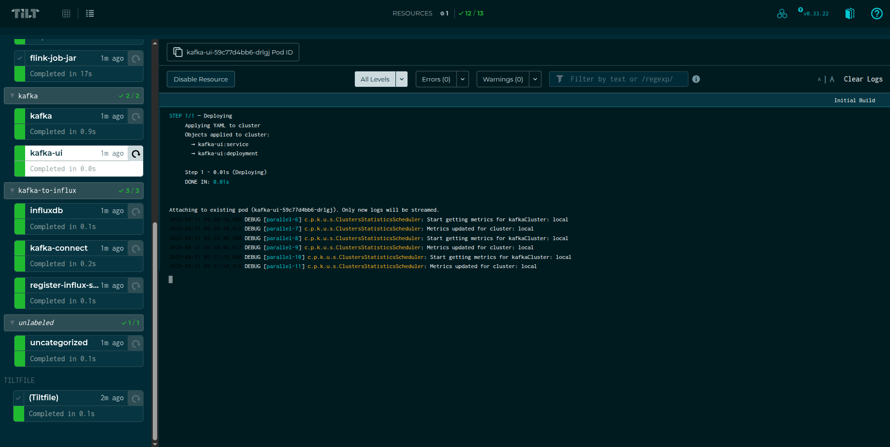
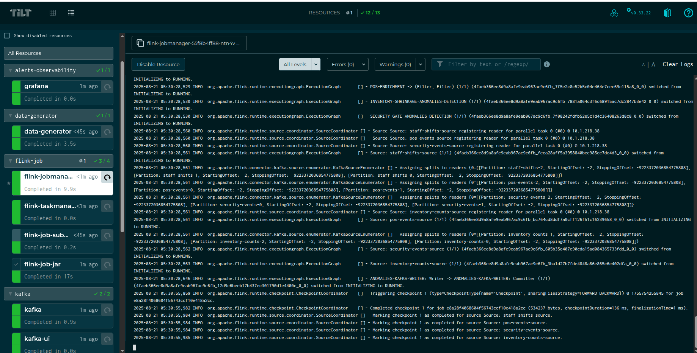
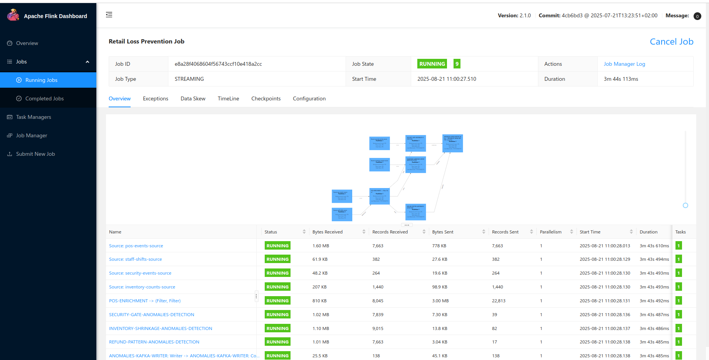
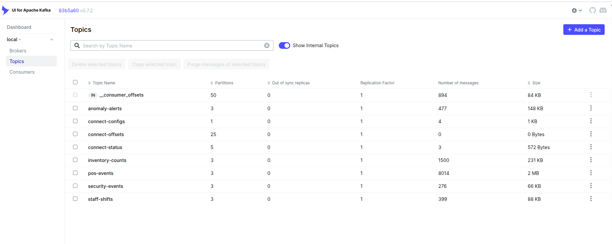

# Real-Time Retail Anomaly Detection with Apache Flink

## 📌 Overview

Retail businesses continuously generate **point-of-sale (POS) transactions, staff activity logs, security events, and inventory counts**. Detecting anomalies like **fraudulent refunds, inventory shrinkage, and suspicious gate entries** in **real-time** is crucial to reducing losses and improving operational efficiency.

This project demonstrates how to build a **real-time anomaly detection pipeline** using **Apache Flink**, integrated with **Kafka, Kubernetes, Tilt, and Grafana** for local development, deployment, and monitoring.

This solution uses **real-time stream processing with Flink** to:

* Enrich POS transactions with staff shift details.
* Detect refund fraud patterns.
* Correlate suspicious sales with security gate events.
* Monitor inventory shrinkage anomalies.
* Push alerts to Kafka for downstream systems and visualization.
---

## 🏗️ System Architecture

**Event Sources** → Kafka Topics(source) → **Flink Processing (Anomaly Detection)** → Kafka Alerts Topic(Sink)→ KafkaConnect -> influxDB(Alerts measurements) -> **Grafana/Monitoring**

**Components:**

1. **Apache Kafka** – Event backbone for POS, staff, security, and inventory streams and alerts output.
2. **Apache Flink** – Core real-time stream processor.
3. **Kubernetes + Tilt** – Local development and deployment.
4. **Grafana + influxDb** – Monitoring, metrics, and visualization.


---

## ⚙️ Tech Stack

* **Stream Processing**: Apache Flink 2.1.0 (Scala 2.12, Java 17)
* **Messaging Layer**: Apache Kafka
* **Deployment**: Kubernetes with Tilt for rapid dev loop
* **Monitoring**: Grafana + influxDB
* **Build Tool**: Maven (Java)

---

## 🔑 Key Features

🚀 Real-time streaming with Apache Flink

📊 Integration with Kafka for scalable event ingestion

🔍 Custom anomaly detection rules tailored to retail operations

📈 Visualization in Grafana with interactive dashboards

🛠️ Developer-friendly setup via Docker + Tilt

## Modules

* **Staff Shift Enrichment**: Enrich POS events with staff shift data via broadcast state.
* **Refund Fraud Detection**: Detects excessive refunds per cashier over a time window.
* **Gate Correlation**: Correlates security gate events with suspicious transactions.
* **Inventory Shrinkage**: Identifies sales not matching stock counts.
* **Alerting**: Unified alerts sent to Kafka for further action or visualization.
* **Data generator**: A python utility to generate test events and publish to corresponding topics(you can adjust as per your need).

---

## 🛠️ Setup & Run Instructions

### 1. Prerequisites

* [Docker](https://www.docker.com/)
* [Kubernetes (microk8s)](https://microk8s.io/#install-microk8s)
* [Tilt](https://tilt.dev/)
* [Maven](https://maven.apache.org/)

### 2. Start the Environment and deploy flink job with Tilt

```
tilt up
```

Tilt will provision:

* Kafka broker and topics
* Kafka ui
* Flink JobManager & TaskManager
* Flink job submitter
* influxdb 
* kafka-connect 
* register-influxdb-sink 
* Grafana 

📌 



### 3. See Flink Job
```
kubectl get pods
```

```
kubectl port-forward flink-jobmanager-55f8b4ff88-ntn4v 8081:8081
```


### 4. See Kafka brokers and topics
```
kubectl get pods
```

```
kubectl port-forward kafka-ui-59c77d4bb6-drlgj 8080:8080
```

### 5. Monitoring in Grafana

```
kubectl get pods
```

```
kubectl port-forward grafana-688545644b-grrj5 3000:3000
```

---
🔎 Detection Scenarios
#### 1. Refund Fraud Detection (RefundPatternFunction)

Fraudulent refund behavior is detected based on unusual patterns of refunds compared to sales.

Examples:

```A cashier issues 6 refunds within 10 minutes, each above $100.
→ Refund Burst Alert is raised with a 100% risk score.

A refund transaction arrives without a matching sale in the system.
→ Refund Without Sale Alert is raised immediately.

Refund processed outside cashier’s shift hours.
→ Risk score is bumped up by +20%, since it’s suspicious.
```

#### 2. Inventory Shrinkage Detection (InventoryShrinkageFunction)

Checks whether the number of items sold exceeds the physical inventory count, indicating potential theft or miscounting.

Examples:

```Inventory count for SKU=12345 is 20 items, but sales data shows 30 items sold since last count.
→ Shrinkage Alert is raised with diff = 10 items.

Threshold = 5; so diff=10 → risk score = 100%.
```

#### 3. Gate & Sale Correlation Detection (GateCorrelationFunction)

Correlates POS sales with security gate sensor triggers to identify suspicious movement of goods.

Examples:

```A customer buys a $500 TV (high-value sale).

Within 2 minutes, the exit gate sensor for Gate-7 triggers unexpectedly.
→ Security Correlation Alert is raised linking saleTxn=TX123 with Gate-7.
If no gate trigger occurs within 2 minutes, the system clears the state (no false positives).

```
---


## 🎯 Conclusion

This project demonstrates how to leverage **Apache Flink** to build a scalable, real-time anomaly detection system for retail operations, reducing fraud and inventory loss while enabling immediate response.
Yu can generate the alerts from the dashboards and metrics by integrating with slack, mail, teams etc.

NOTE: You should adjust the [data-gen](data-gen) to simulate the end to end flow as per your need to test locally.
---